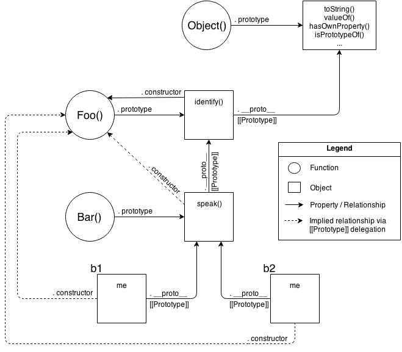

# Chapter 6: Behavior Delegation

지난 5장의 결론을 한 문장으로 요약하면<br>
[[Prototype]]체계는 한 객체가 다른 객체를 참조하기 위한 내부 링크다.<br>
<br>
자바스크립트 엔진은 [[Prototype]] 링크를 따라가며 연결된 객체마다 프로퍼티/메서드가 존재하는지 확인한다.<br>
해당 객체가 존재하지 않는다면 다음 [[Prototype]]링크에 연결된 객체를 타고 이동하며,<br>
이러한 객체간의 연결 고리가 바로 **프로토타입 체인** 이다.<br>
다시 말해서 javascript에서 중요한 핵심 기능이자 실제적인 체계는 <br>
**객체를 다른 객체와 연결하는것(Objects Linked to Other Objects)** 에서 비롯된다.

## Towards Delegation-Oriented Design (위임지향)

우리는 4장에서 [[Prototype]]이 클래스와는 근본부터 다른 디자인 패턴이라는 사실을 학습하였다.<br>
<br>
앞으로 우리는 기존의 클래스/상속 디자인 패턴에서 행동위임 디자인 패턴(behavior delegation design pattern)으로<br>
바꿔줄 필요가 있다. 아래에서는 몇가지 이론을 배운 후 구체적인 예제를 하나씩 살펴 보도록 하다.

### Class Theory (클래스 이론)

소프트웨어 모델링에 필요한 유사한 테스크 3가지가 있다고 가정해 보자.<br>
일반적으로 부모 클래스에 공통기능을 정의한후 자식클래스에 특화된 기능을 각각 정의할 것이다.

```javascript
class Task {
    id;

    // constructor `Task()`
    Task(ID) { id = ID; }
    outputTask() { output( id ); }
}

class XYZ inherits Task {
    label;

    // constructor `XYZ()`
    XYZ(ID,Label) { super( ID ); label = Label; }
    outputTask() { super(); output( label ); }
}

class ABC inherits Task {
    // ...
}
```

위코드는 일반적인 클래스 이론을 적용한 소스코드 이다.<br>
부모 Task 를 XYZ와 ABC가 상속을 받아 메서드를 오버라이드하여 더 세분화 하는 일반적으로 익숙한 모습일 것이다.<br>
이때 XYZ와 ABC 인스턴스에는 모두 복사되어 옮겨진 상태이다.

### Delegation Theory (위임 이론)

이번에는 같은 문제를 위임이론을 적용하여 생각해 보자.<br>
먼저 Task객체를 정의한 후, 각각 테스크별 객체를 정의한 후 Task 객체에 연결해 필요할 때마다<br>
특정 테스크 객체가 Task에 작동을 위임하는 형식이다.

```javascript
var Task = {
    setID: function(ID) { this.id = ID; },
    outputID: function() { console.log( this.id ); }
};

// make `XYZ` delegate to `Task`
var XYZ = Object.create( Task );

XYZ.prepareTask = function(ID,Label) {
    this.setID( ID );
    this.label = Label;
};

XYZ.outputTaskDetails = function() {
    this.outputID();
    console.log( this.label );
};

// ABC = Object.create( Task );
// ABC ... = ...
```

역자는 이런 스타일로 작성된 코드를 OLOO(Objects Linked to Other Objects)라고 부른다.<br>
OLOO style code 는 아래와 같은 특징을 가진다.

1. ID, Label 같은 데이터 맴버는 Task가 아닌 XYZ,ABC 의 직속 프로퍼티이다.

2. 메서드의 이름을 다르게 해주어 [[Prototype]] 체인시 충돌되는 일이 없이 해준다. (self documenting)

3. this 바인딩 규칙에 따라서 Task가 가지고 있는 유틸리티 메서드에 대해서 XYZ,ABC가 언제든지 이용할수 있다.

즉 위임 이론이란 프로퍼티/메서드가 레퍼런스 객체에 없을 경우 다른 객체로 수색 작업을 하는것을 의미 한다.<br>
부모/자식같은 수직적 클래스 다이어그램은 지우고 객체들이 수평적으로 위임 링크가 연결되는 강력한 디자인 패턴인 것이다.

#### Debugged

브라우저별로 자바스크립트 엔진에 따라 디버깅을 할시에 나오는 같이 다른 이유는<br>
개발자 툴에 표시되어져야 할 값이나 구조가 자바스크립트 명세로 정해진게 아니여서 이다.<br>
아래는 크롬 개발자 도구의 콘솔창에서의 결과이다.

```javascript
function Foo() {}

var a1 = new Foo();

a1; // Foo {}
```
파이어폭스 콘솔에서는 Object{} 로 표시 된다. 이 차이점은 무엇인가..?<br>
크롬 입장에선 Foo라고 명명된 함수는 빈 객체이다 라는 의미이고 <br>
파폭 입장에선 {}는 Object에 의해 일반적으로 생성된 빈 객체다 라고 본 것이다.<br>
크롬은 내부 프로퍼티를 추적하여 함수명을 보여준 반면에 파폭은 아닌것이다.<br>
자바 스크립트 코드로 좀더 보자.<br>

```javascript
function Foo() {}

var a1 = new Foo();

a1.constructor; // Foo(){}
a1.constructor.name; // "Foo"
```
이 코드를 보면 a1을 호출할때에는 단순히 constructor.name만을 바라보는 것일까?<br>
다음 코드를 보면 좀더 확실해 진다.

```javascript
function Foo() {}

var a1 = new Foo();

Foo.prototype.constructor = function Gotcha(){};

a1.constructor; // Gotcha(){}
a1.constructor.name; // "Gotcha"

a1; // Foo {}
```
constructor.name을 문법에 맞추어 Gotcha로 바꾸어 주었다.<br>
하지만 a1 을 호출한 값은 Foo로 나온거로 보아 질문의 답은 아니다 이다.<br>
그럼 마지막으로 OLOO로 바꾸어 보자

```javascript
var Foo = {};

var a1 = Object.create( Foo );

a1; // Object {}

Object.defineProperty( Foo, "constructor", {
    enumerable: false,
    value: function Gotcha(){}
});

a1; // Gotcha {}
```
defineProperty 사용방법  :[defineProperty](https://developer.mozilla.org/ko/docs/Web/JavaScript/Reference/Global_Objects/Object/defineProperty)

결국 .constructor.name 을 이용하고 있다는게 확인이 되었다.

### Mental Models Compared (모델 비교)

두 코딩 방식을 비교해 볼것이다. (OO vs. OLOO)<br>
먼저 고전적인 OO 방식이다.

```javascript
function Foo(who) {
    this.me = who;
}
Foo.prototype.identify = function() {
    return "I am " + this.me;
};

function Bar(who) {
    Foo.call( this, who );
}
Bar.prototype = Object.create( Foo.prototype );

Bar.prototype.speak = function() {
    alert( "Hello, " + this.identify() + "." );
};

var b1 = new Bar( "b1" );
var b2 = new Bar( "b2" );

b1.speak();
b2.speak();
```

다음은 OLOO 방식이다.

```javascript
var Foo = {
    init: function(who) {
        this.me = who;
    },
    identify: function() {
        return "I am " + this.me;
    }
};

var Bar = Object.create( Foo );

Bar.speak = function() {
    alert( "Hello, " + this.identify() + "." );
};

var b1 = Object.create( Bar );
b1.init( "b1" );
var b2 = Object.create( Bar );
b2.init( "b2" );

b1.speak();
b2.speak();
```

앞에서 b1 -> Bar.prototype -> Foo.prototype 순서로 위임한 것을 <br>
b1 -> Bar -> Foo 순서로 [[Prototype]] 우임을 활용하여 연결하였다.<br>
<br>
여기에서 중요한 점은 <br>
클래스처럼 보이게 하려는 new, 생성자코드들 프로토타입 같은 잡다한 코드들이 다 사라졌다는 점이다.<br>
관계의 모델링은 중요하지 않으니 개체와 관계도를 보도록 해보자



다음은 OLOO 스타일의 관계도이다.


한눈에 보기에도 심플해 보인다.<br>
OLOO(objects linked to other objects) 스타일은 다른 객체와의 연결에만 집중하면 되므로 간결해 질수밖에 없다.<br>
결과가 같다면 심플이 최고 아닐까?

## 마치며
잼있는 시간이였군  :)
이제 다음 클래스와 객체를 비교해 보시죠
